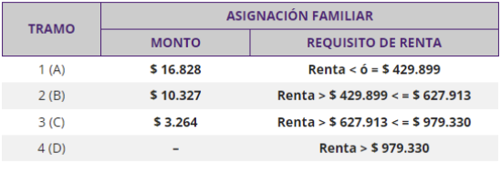

# Ejercicio individual 5 módulo 3 - Sebastián Segura

## Requerimientos

1. Cree una función que reciba como parámetros NOMBRE y APELLIDOS de una persona y
   devuelva el valor de ellos en mayúsculas.
2. Cree una segunda función que muestre los datos de `Nombre` y `Apellidos` y solicite:

   - Dos montos (dos números enteros) para:
      - sueldo base actual
      - sueldo base promedio del
     semestre anterior.

   - Que ingrese el dato de si tiene cargas familiares autorizadas.

   - Si tiene cargas familiares autorizadas, retorne otro entero que sea el valor que le corresponde según la tabla siguiente:

     

     El valor a usar como renta es el monto del semestre anterior. La respuesta será:

     `Al Trabajador NOMBRE APELLIDOS le corresponde valor de familiar (0, 3264, 10327 o 16828) por su renta del semestre anterior que es: monto (uno de los 4).`

3. Cree una función que, para las personas que si tienen asignación familiar, consulte:
   
   - La cantidad de “beneficiados con carga familiar (recibe como parámetro un número entero r
   que indique la cantidad de personas con el beneficio) 
   
   Y retorne:
   
      - el número que corresponda al monto a recibir por carga familiar, obtenido en el punto anterior, multiplicado por la cantidad de beneficiarios. 
   
   Por ejemplo: 
         
      `Una persona con beneficio de 10327 y 3 cargas familiares deberá responder con 30981.`

4. Cree un programa que utilice el objeto persona y entregue todos los datos obtenidos, de
   las funciones anteriores:
   - La persona de:
      - Nombre:
      - Apellidos:
      - Cargas (si/no):
      - Cantidad de Cargas familiares:
      - Está en el tramo que corresponde al ingreso del semestre anterior:
      - Le corresponde por carga familiar el monto:
      - Le corresponde el monto total de carga familiar de:
      - Su sueldo del mes más las cargas familiares es de:

## Estructura del proyecto

```
├── README.md
├── assets
│   └── img
│       └── image.png
└── script.js
```

## Instruccciones

1. Ubicado en la carpeta raiz del proyecto debes ejecutar

```bash
node script.js
```